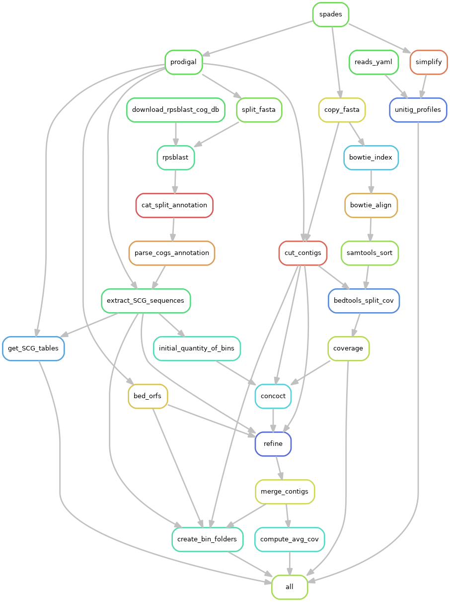
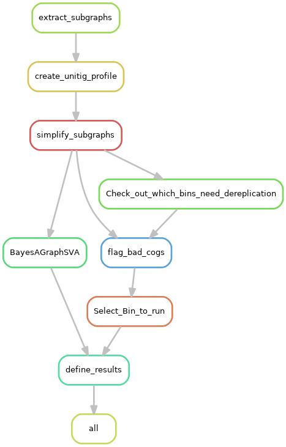
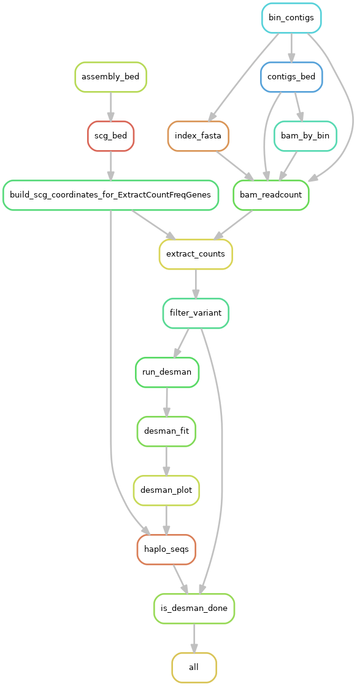
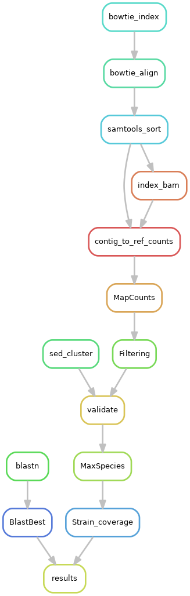

# STRONG - Strain Resolution ON Graphs

## Overview

STRONG resolves strains on assembly graphs by resolving variants on core COGs using co-occurrence across multiple samples.

## Table of Contents  

[Installation](#Installation)  
[Quick Start](#QuickStart)  
[Config File](#ConfigFile)  
[Pipeline](#Pipeline)  
[Results](#Results)  
[Synthetic community data](#Synthetic)  

<a name="Installation"/>

## Installation

### Prerequisites

The following pieces of software should be installed on your machine before attempting to install STRONG
    - conda (miniconda)
    - cmake, zlib, GNU readline, G++
    
For a standard Ubuntu 16.04 distribution. The above packages would be installed as:

```
    sudo apt-get update
    sudo apt-get -y install libbz2-dev libreadline-dev cmake g++ zlib1g zlib1g-dev
```

We then need to install miniconda we recommend the Python 3.8 version.
To install miniconda follow the instructions [here](https://docs.conda.io/en/latest/miniconda.html).
Remember that conda activation may require logging back in again.

### Conda installation

STRONG can be installed anywhere but for the below we assume it will be placed in a location
SPATH that you set as an environment variable:
 that you 
may have to create in your home dir:
```
export SPATH=/mypath/to/repos
cd $SPATH
```

We begin by cloning STRONG recursively:

```
git clone --recurse-submodules https://github.com/chrisquince/STRONG.git
```

STRONG contains [DESMAN](https://github.com/chrisquince/DESMAN) and [BayesPaths](https://github.com/chrisquince/BayesPaths) as submodules.

If you need to update in future:

```
cd STRONG
git submodule foreach git pull origin master
```

We recommend that you first compile the SPAdes and COG tools executables outside of conda:

```
cd ./STRONG/SPAdes/assembler

./build_cog_tools.sh 

```

The full list of requirements is listed in the file conda_env.yaml we recommend mamba for install. This can be 
itself installed through conda by:
```
conda install -c conda-forge mamba
```

Then we use mamba to resolve the STRONG environment from within the STRONG home directory:

```
cd $SPATH/STRONG

mamba env create -f conda_env.yaml
```

This should take 5 - 10 minutes with mamba.


Once the STRONG environment has been installed activate it with the following command :

```
conda activate STRONG
```


It is also necessary to install the BayesPaths executable with the STRONG conda:

```
cd BayesPaths
python ./setup.py install
```

And also DESMAN:

```
cd ../DESMAN
python ./setup.py install
```


BayesPaths uses precompiled executables in the runfg_source directory. These are only compatible 
with Linux x86-64 and on other platforms they will require compilation from source see
the [BayesPaths repo](https://github.com/chrisquince/BayesPaths]) for details. 


We will also need a version of the COG database installed. We make this available for download 
and it can be placed anywhere. Here we point the DB_PATH variable to its location which should 
be chosen appropriately:

```
export DB_PATH=/path/to_my/database
cd $DB_PATH
wget https://strongtest.s3.climb.ac.uk/rpsblast_cog_db.tar.gz
tar -xvzf rpsblast_cog_db.tar.gz
rm rpsblast_cog_db.tar.gz
```

Unfortunately there is a bug in the conda CONCOCT package caused by updates to Pandas
this needs to be fixed before running the pipeline:

```
CPATH=`which concoct_refine`
sed -i 's/values/to_numpy/g' $CPATH
sed -i 's/as_matrix/to_numpy/g' $CPATH
sed -i 's/int(NK), args.seed, args.threads)/ int(NK), args.seed, args.threads, 500)/g' $CPATH
```

The pipeline will attempt downloads of missing databases but we recommend preinstalling. If 
MAG classifications are required from GTDB then this database should be installed inside 
the conda installation. In our clean VM that would be here:

```
cd /home/ubuntu/miniconda3/envs/STRONG/share/gtdbtk-1.2.0/

```

The actual download may take a while:

```
wget https://data.ace.uq.edu.au/public/gtdb/data/releases/release95/95.0/auxillary_files/gtdbtk_r95_data.tar.gz
tar xvzf gtdbtk_r95_data.tar.gz
rm -r db
mv release95 db
```

## Native installation (Not supported yet)

STRONG has a lot of required software, at the moment we recommend using the conda recipe above.

<a name="QuickStart"/>

## Quick start

First we will download a fairly simple synthetic test data set from known microbial strains into another directory 
/mypath/torunthings/STRONG_Runs that we will use for STRONG output:

```
export SRPATH=/mypath/torunthings/STRONG_Runs
mkdir $SRPATH
cd  $SRPATH
wget https://strongtest.s3.climb.ac.uk/Test.tar.gz
tar -xvzf Test.tar.gz
rm Test.tar.gz
```

We are now ready to run STRONG from within the STRONG directory. Two example yamls are 
provided in the SnakeNest directory, for a high quality run of real data start from config.yaml but for this simple example 
use test_config.yaml which assumes a maximum of 5 strains per MAG as explained below.
This file will need to be edited though. The following edits are necessary:

1. The data directory needs to point at the samples to be assembled in this case edit:

```
data: /mypath/torunthings/STRONG_Runs/Test
```

2. The cog_database field to:
```
cog_database: /path/to_my/database/rpsblast_cog_db/Cog
```

3. The evaluation genomes field which contains the known genomes to validate to 
```
genomes: /mypath/torunthings/STRONG_Runs/Test/Eval
```
For real data this step would be deactivated by setting 'execution: 0'

 <!--- 
4. The path to the DTDB database
```
gtdb_path: "/home/ubuntu/miniconda3/envs/STRONG/share/gtdbtk-1.2.0/db/release95"
```
--> 

All these paths need to be absolute see below for more details on the config file.

Then run the following command:

```
cd $SPATH/STRONG/
./bin/STRONG --config ./SnakeNest/test_config.yaml $SRPATH/TestResults --threads 8 --dryrun --verbose
```

This will run the pipeline in 'dryrun' mode which will list commands to be run without actually 
executing. This can only get as far as a checkpoint where an assertion error will be generated. Do 
not worry about this. If it looks similar to:
```
Step #3 - Strain Decomposition
...
AssertionError in line 184 of /home/ubuntu/repos/STRONG/SnakeNest/Common.snake.
  File "/home/ubuntu/repos/STRONG/SnakeNest/BayesAGraph.snake", line 7, in <module>
  File "/home/ubuntu/repos/STRONG/SnakeNest/Common.snake", line 184, in read_selected_bins
Traceback (most recent call last):
  File "./bin/STRONG", line 96, in <module>
    call_snake(["--snakefile", "SnakeNest/BayesAGraph.snake"])
  File "./bin/STRONG", line 81, in call_snake
    subprocess.check_call(base_params + extra_params, stdout=sys.stdout, stderr=sys.stderr)
  File "/home/ubuntu/miniconda3/envs/STRONG/lib/python3.7/subprocess.py", line 363, in check_call
    raise CalledProcessError(retcode, cmd)
subprocess.CalledProcessError: Command '['snakemake', '--directory', '/home/ubuntu/STRONG_Runs/TestResults2', '--cores', '8', '--config', 'LOCAL_DIR=/home/ubuntu/repos/STRONG', '--configfile=/home/ubuntu/STRONG_Runs/TestResults2/config.yaml', '--latency-wait', '120', '-k', '-p', '-r', '--verbose', '--dryrun', '--snakefile', 'SnakeNest/BayesAGraph.snake']' returned non-zero exit status 1.

```

Then it is fine to run the actual pipeline as follows:
```
python3 ./start.py --config config.yaml $SRPATH/TestResults --threads 8 --verbose
```
The number of threads is optional and should be set as appropriate to your system.

<a name="ConfigFile"/>

## Config file

The config yaml file is used to store the parameters of a run. It is divided into 
sections with parts corresponding to the different steps of the pipeline. This is the test_config.yaml 
for the Test data set as an example. We will deal with parameters that are specific to these steps below 
in the relevant steps but we will highlight a few general parameters here.

```
# ------ Samples ------
samples: '*' # specify a list samples to use or '*' to use all samples

# ------ Resources ------
threads : 8 # single task nb threads

# ------ Assembly parameters ------ 
data:  /home/ubuntu/STRONG_Runs/Test  # path to data folder

# ----- Annotation database -----
cog_database: /home/ubuntu/rpsblast_cog_db/Cog # COG database

# ----- Binning parameters ------
concoct_contig_size: 1000
read_length: 150
assembly: 
    assembler: spades
    k: [77]
    mem: 2000
    threads: 24

# ----- BayesPaths parameters ------
bayespaths:
    nb_strains: 5
    nmf_runs: 1
    max_giter: 1
    min_orf_number_to_merge_bins: 10
    min_orf_number_to_run_a_bin: 10
    percent_unitigs_shared: 0.1

# ----- DESMAN parameters ------
desman:
    execution: 1
    nb_haplotypes: 10
    nb_repeat: 5
    min_cov: 1

# -----  Evaluation ------
evaluation:
    execution: 1
    genomes: "/home/ubuntu/STRONG_Runs/Test/Eval" # path to reference genomes
    
```

### Sample specification

STRONG will look for samples in the directory specified by the **data** parameter so above this points 
to '/home/ubuntu/STRONG_Runs/Test' inside this directory subdirectories should be present named 
sample1, ..., sampleN these correspond to different samples. The program will expect sequencing 
reads present in each subdirectory 'sampleX' with file names 'sampleX_R1.fq.gz'  and 'sampleX_R2.fq.gz'
for the forward and reverse reads. These are assumed paired other file formats e.g. not gzipped should 
also work. In the sample test data used above eight samples are used. 


### GTDB MAG classification

If you wish MAGs to be classified with the excellent [GTDBTk program](https://github.com/Ecogenomics/GTDBTk) 
then simply specify the location of the GTDB database adding following line to config for example:

```
gtdb_path: "/mypathto/miniconda3/envs/gtdbtk/share/gtdbtk-0.3.2/db"
```

<a name="Pipeline"/>

## Pipeline

### Assembly, COG annotation and binning 

The first step of the pipeline is a coassembly of all samples followed by binning. The 
full pipeline is complex and summarised in the figure:



We will explain the config parameters relevant to these steps. These are:

1. ***concoct_contig_size***: mininum contig length for the CONCOCT binning
2. ***read_length***: read length used for sequencing 

Then within the ***assembly*** subsection:

3. ***assembler***: program for coassembly currently on metaSPAdes is support specify as ***spades***
4. ***k***: kmer length for assembly 77 is a good choice for 150 bp reads. It is possible to use a list of 
kmers here but they should all be odd so for instance '[33,55,77]' 
5. ***mem***: This is the maximum memory allocated to metaSPAdes in Mb it may have to be increased above 2000 
for complex data sets:
5. ***threads***: The number of threads used by metaSPAdes

This part of the pipeline produces a number of intermediate output files. We detail the key ones here:

1. ***assembly/spades/***: This directory contains the standard metaSPAdes run including ***assembly.fasta*** the contigs used in MAG construction 
2. ***assembly/high_res/***: This directory contains the high resolution assembly graph pre- ***graph_pack.gfa*** and post-simplication ***simplified.gfa*** 
and also ***simplified.mult_prof*** the unitig kmer coverages of the simplified graph across samples
3. ***annotation***: This directory contains contains the contig ORF predictions and COG annotations with RPS-BLAST
4. ***binning***: Contains the CONCOCT bins post refinement and merging these are given in ***clustering_gt1000_merged.csv*** as a csv file of contig names 
with bin assignments together with a list of MAGs satisfying 75% single-copy core genes in single copy ***list_mags.tsv*** 

The list of single-copy core genes are given as COGs in the data file ***SnakeNest/scg_data/scg_cogs_to_run.txt*** as default but this file can be changed.


### BayesPaths

### Desman 

### Results

### Evaluation


<a name="Results"/>

## Results

<a name="Synthetic"/>

## Synthetic community data

