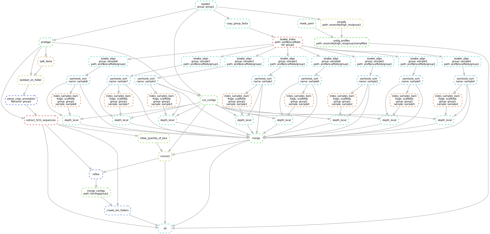

# STRONG - Strain Resolution ON Graphs

## Overview

STRONG resolves strain on assembly graphs by resolving variants on core COGs using co-occurrence across multiple samples.

## Installation

Requires recursive cloning:

git clone --recurse-submodules https://github.com/chrisquince/STRONG.git


## Quick start

Run from within the COG_pipe directory. Using the following command:

```
python3 ./start.py --config config.yaml output_dir --threads 32
```

Optionally pass snakemake parameters e.g. '--dryrun'

## Config file

```
data: /mnt/gpfs/Hackathon/SyntheticCommunity  # path to data folder
cog_database: /home/sebr/seb/Database/rpsblast_cog_db/Cog
soft: "/home/sergei/cog_tools"
concoct_contig_size: 1000
read_length: 150
assembly: 
    k: 77
    assembler: spades
    dir: /home/sergei/cog_tools/spades/bin
    groups: ['*']
```

## Pipeline




