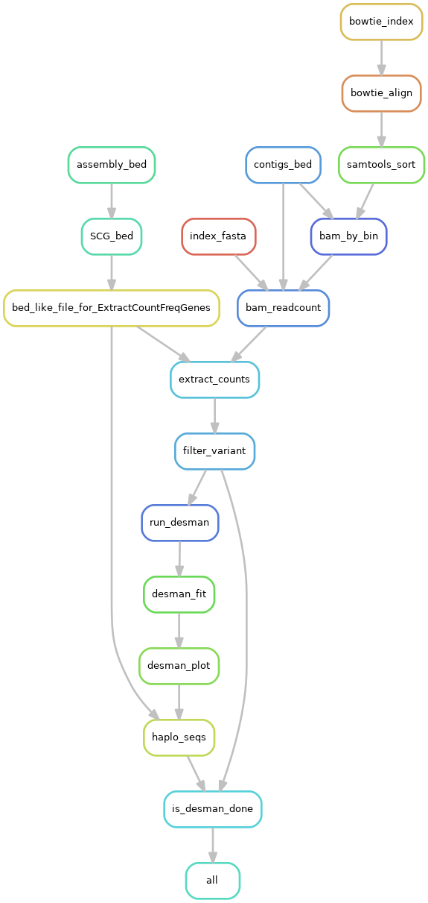

# STRONG - Strain Resolution ON Graphs

## Overview

STRONG resolves strains on assembly graphs by resolving variants on core COGs using co-occurrence across multiple samples.

## Table of Contents  

[Installation](#Installation)  
[Quick Start](#QuickStart)  
[Usage](#Usage)  
[Config File](#ConfigFile)  
[Detailed Pipeline](#Pipeline)  
[Synthetic community data](#Synthetic)  

<a name="Installation"/>

## Installation

### Prerequisites

The following pieces of software should be installed on your machine before attempting to install STRONG
    - conda (miniconda)
    - cmake, zlib, GNU readline, G++
    
For a standard Ubuntu 16.04 distribution. The above packages would be installed as:

```
    sudo apt-get update
    sudo apt-get -y install libbz2-dev libreadline-dev cmake g++ zlib1g zlib1g-dev
```

We then need to install miniconda we recommend the Python 3.8 version.
To install miniconda follow the instructions [here](https://docs.conda.io/en/latest/miniconda.html).
Remember that conda activation may require logging back in again.

## Conda installation

STRONG can be installed anywhere but for the below we assume it will be placed in a location SPATH that you set as an environment variable:
```
export SPATH=/mypath/to/repos
cd $SPATH
```

We begin by cloning STRONG recursively:

```
git clone --recurse-submodules https://github.com/chrisquince/STRONG.git
```

STRONG contains [DESMAN](https://github.com/chrisquince/DESMAN) and [BayesPaths](https://github.com/chrisquince/BayesPaths) as submodules.

If you need to update in future:

```
cd STRONG
git submodule foreach git pull origin master
```
#### Automatic installation

All the steps described below have been compiled for convenience in the install_STRONG.sh script. 
It is mostly silent and all logs are found in install.log. 
This script does not however install any databases. So please refer to corresponding section for those : [Database needed (COG)](#DB_cog)  

Inside the STRONG directory, type the following command:
```
./install_STRONG.sh 
```


#### SPAdes/DESMAN/Bayespath manual installation

We recommend that you first compile the SPAdes and COG tools executables outside of conda:

```
cd ./STRONG/SPAdes/assembler

./build_cog_tools.sh 

```

The full list of requirements is listed in the file conda_env.yaml we recommend mamba for install. This can be 
itself installed through conda by:
```
conda install -c conda-forge mamba
```

Then we use mamba to resolve the STRONG environment from within the STRONG home directory:

```
cd $SPATH/STRONG

mamba env create -f conda_env.yaml
```

This should take 5 - 10 minutes with mamba. 


Once the STRONG environment has been installed activate it with the following command :

```
conda activate STRONG
```


It is also necessary to install the BayesPaths executable with the STRONG conda:

```
cd BayesPaths
python ./setup.py install
```

And also DESMAN:

```
cd ../DESMAN
python ./setup.py install
```


BayesPaths uses precompiled executables in the runfg_source directory. These are only compatible 
with Linux x86-64 and on other platforms they will require compilation from source see
the [BayesPaths repo](https://github.com/chrisquince/BayesPaths]) for details. 

#### Fix conda install

 1. Fix concoct refine

Unfortunately there is a bug in the conda CONCOCT package caused by updates to Pandas
this needs to be fixed before running the pipeline:

```
CPATH=`which concoct_refine`
sed -i 's/values/to_numpy/g' $CPATH
sed -i 's/as_matrix/to_numpy/g' $CPATH
sed -i 's/int(NK), args.seed, args.threads)/ int(NK), args.seed, args.threads, 500)/g' $CPATH
```

 2. Fix R lapack library location item

There is a bug in the current conda install of R where the lapack library while being present is not exactly where it should be for all required library to work. It is easily fixed with symbolic link
```
ln -s $CONDA_PREFIX/lib/R/modules/lapack.so $CONDA_PREFIX/lib/R/modules/libRlapack.so
```

<a name="DB_cog"/>

#### Database needed (COG)
We will also need a version of the COG database installed. We make this available for download 
and it can be placed anywhere. Here we point the DB_PATH variable to its location which should 
be chosen appropriately:

```
export DB_PATH=/path/to_my/database
cd $DB_PATH
wget https://microbial-metag-strong.s3.climb.ac.uk/rpsblast_cog_db.tar.gz
tar -xvzf rpsblast_cog_db.tar.gz
rm rpsblast_cog_db.tar.gz
```

#### Optional Database (GTDB)
GTDB is used in the last part of the pipeline as for MAG classification optionally. If the a gtdb path is given in the config file, STRONG will check naively for its presence and will download it if it is absent. 
We recommand preinstalling it, the actual download may take a while:

```
wget https://data.ace.uq.edu.au/public/gtdb/data/releases/release95/95.0/auxillary_files/gtdbtk_r95_data.tar.gz
tar xvzf gtdbtk_r95_data.tar.gz
rm -r db
mv release95 db

```

### Check install
Some issues may crop up with R libraries and/or forgotten installation step. This can be checked for by running `SnakeNest/scripts/check_on_dependencies.py`

## Native installation (Not supported yet)

STRONG has a lot of required software, at the moment we recommend using the conda recipe above.

<a name="QuickStart"/>

## Quick start

First we will download a fairly simple synthetic test data set from known microbial strains into another directory 
/mypath/torunthings/STRONG_Runs that we will use for STRONG output:

```
export SRPATH=/mypath/torunthings/STRONG_Runs
mkdir $SRPATH
cd  $SRPATH
wget https://microbial-metag-strong.s3.climb.ac.uk/Test.tar.gz
tar -xvzf Test.tar.gz
rm Test.tar.gz
```

We are now ready to run STRONG from within the STRONG directory. Two example yamls are 
provided in the SnakeNest directory, for a high quality run of real data start from config.yaml but for this simple example 
use test_config.yaml which assumes a maximum of 5 strains per MAG as explained below.
This file will need to be edited though. The following edits are necessary:

1. The data directory needs to point at the samples to be assembled in this case edit:

```
data: /mypath/torunthings/STRONG_Runs/Test
```

2. The cog_database field to:
```
cog_database: /path/to_my/database/rpsblast_cog_db/Cog
```

3. The evaluation genomes field which contains the known genomes to validate to 
```
genomes: /mypath/torunthings/STRONG_Runs/Test/Eval
```
For real data this step would be deactivated by setting 'execution: 0'

 <!--- 
4. The path to the DTDB database
```
gtdb_path: "/home/ubuntu/miniconda3/envs/STRONG/share/gtdbtk-1.2.0/db/release95"
```
--> 

All these paths need to be absolute see below for more details on the config file.

Then run the following command:

```
cd $SPATH/STRONG/
./bin/STRONG --config ./SnakeNest/test_config.yaml $SRPATH/TestResults --threads 8 --dryrun --verbose
```

This will run the pipeline in 'dryrun' mode which will list commands to be run without actually 
executing. This can only get as far as a checkpoint where an assertion error will be generated. Do 
not worry about this. If it looks similar to:
```
Step #3 - Strain Decomposition
...
AssertionError in line 184 of /home/ubuntu/repos/STRONG/SnakeNest/Common.snake.
  File "/home/ubuntu/repos/STRONG/SnakeNest/BayesAGraph.snake", line 7, in <module>
  File "/home/ubuntu/repos/STRONG/SnakeNest/Common.snake", line 184, in read_selected_bins
Traceback (most recent call last):
  File "./bin/STRONG", line 96, in <module>
    call_snake(["--snakefile", "SnakeNest/BayesAGraph.snake"])
  File "./bin/STRONG", line 81, in call_snake
    subprocess.check_call(base_params + extra_params, stdout=sys.stdout, stderr=sys.stderr)
  File "/home/ubuntu/miniconda3/envs/STRONG/lib/python3.7/subprocess.py", line 363, in check_call
    raise CalledProcessError(retcode, cmd)
subprocess.CalledProcessError: Command '['snakemake', '--directory', '/home/ubuntu/STRONG_Runs/TestResults2', '--cores', '8', '--config', 'LOCAL_DIR=/home/ubuntu/repos/STRONG', '--configfile=/home/ubuntu/STRONG_Runs/TestResults2/config.yaml', '--latency-wait', '120', '-k', '-p', '-r', '--verbose', '--dryrun', '--snakefile', 'SnakeNest/BayesAGraph.snake']' returned non-zero exit status 1.

```

Then it is fine to run the actual pipeline as follows:
```
./bin/STRONG $SRPATH/TestResults --threads 8 --verbose
```
The number of threads is optional and should be set as appropriate to your system.

<a name="Usage"/>

## Usage

STRONG should be run from within the STRONG repository minimal usage as follows:

```
./bin/STRONG outputdir
```

This will run all steps generate output in ***outputdir*** and search for the config yaml in ***outputdir***. Optionally the config file can be specified:

```
./bin/STRONG outputdir --config config.yaml
```

It is also possible to run just part of the pipeline:

1. ***assembly***: Runs just the [assembly steps](#assembly)  
2. ***graphextraction***: Runs just the [graph extraction](#graphextraction)
3. ***bayespaths***: Runs just the [bayespaths](#bayespaths)
4. ***evaluation***:  Runs just the [evaluation steps](#evaluation)
5. ***results***:  Runs just the [results steps](#results)
6. ***desman***:  Runs just the [desman steps](#desman)

By specifying desired step e.g.:
```
./bin/STRONG outputdir --config config.yaml bayespaths
```

This is useful if for example you wish to rerun strain resolution with alternate parameters then simily remove the bayespaths directory and rerun as above.

The program also takes the following optional parameters:

```
  --threads THREADS, -t THREADS
```

Specify the maximum thread number to be used.

```
  --verbose, -v         Increase verbosity level
```

Useful to obtain more info from SnakeMake

```
  --dryrun, -n          Show tasks, do not execute them
```

Again snakemake command to list commands that would be run not to actually execute them.


```
  --unlock, -u          Unlock the directory
```

Will unlock directories if snakemake fails.

```
  --dag DAG, -d DAG     file where you want the dag to be stored
```

Generate diagram of jobs.


```
  -s ...                Pass additional argument directly to snakemake
```

Enables any additional commands to be passed to snakemake.

  

<a name="ConfigFile"/>

## Config file

The config yaml file is used to store the parameters of a run. It is divided into 
sections with parts corresponding to the different steps of the pipeline. This is the test_config.yaml 
for the Test data set as an example. We will deal with parameters that are specific to these steps below 
in the relevant steps but we will highlight a few general parameters here.

```
# ------ Samples ------
samples: ['sample*'] # specify a list samples to use or '*' to use all samples

# ------ Resources ------
threads : 8 # single task nb threads

# ------ Assembly parameters ------ 
data:  /home/ubuntu/STRONG_Runs/Test  # path to data folder

# ----- Annotation database -----
cog_database: /home/ubuntu/rpsblast_cog_db/Cog # COG database

# ----- Binner ------
binner: "concoct"

# ----- Binning parameters ------
concoct:
    contig_size: 1000

read_length: 150
assembly: 
    assembler: spades
    k: [77]
    mem: 2000
    threads: 24

# ----- BayesPaths parameters ------
bayespaths:
    nb_strains: 5
    nmf_runs: 1
    max_giter: 1
    min_orf_number_to_merge_bins: 18
    min_orf_number_to_run_a_bin: 10
    percent_unitigs_shared: 0.1

# ----- DESMAN parameters ------
desman:
    execution: 1
    nb_haplotypes: 10
    nb_repeat: 5
    min_cov: 1

# -----  Evaluation ------
evaluation:
    execution: 1
    genomes: "/home/ubuntu/STRONG_Runs/Test/Eval" # path to reference genomes
```

### Sample specification

STRONG requires for all samples to be in separate folders inside the **data** directory specified above, here this points to '/home/ubuntu/STRONG_Runs/Test'. STRONG needs exactly 2 paired reads files ending with any of the following .fasta, .fasta.gz, .fa, .fna, .fsa, .fastq, .fastq.gz, .fq, .fq.gz, .fna.gz.  No check is done at this point and the pipeline will naturally fail during assembly if your samples do not contain the same number of reads or are not paired.... 
In the sample test data used above eight samples are used. 

Using  the ***samples*** variable it is possible to use bash extended globbing to select which folder should be run. The simplest specification is : ['\*'] which will select all folder inside   **data** directory, in our example this equivalent to the also valid : ["sample1", "sample2", "sample3", "sample4", "sample5", "sample6", "sample7", "sample8".]. More complicated expression can be used, for instance : ['\*{[1-3],[6-7]}'], this will select any folder ending with 1,2,3,6,7. This can be tested beforehand on terminal console.


### GTDB MAG classification

If you wish MAGs to be classified with the excellent [GTDBTk program](https://github.com/Ecogenomics/GTDBTk) 
then simply specify the location of the GTDB database adding following line to config for example:

```
gtdb_path: "/mypathto/miniconda3/envs/gtdbtk/share/gtdbtk-0.3.2/db"
```

<a name="Pipeline"/>

## Pipeline

<a name="assembly"/>

### Assembly, COG annotation and binning 

The first step of the pipeline is a coassembly of all samples followed by binning. This 
involves multiple steps, including mapping with bowtie2 to get coverages and annotations 
to COGs with RPS-Blast, this is summarised in the figure:


We will explain the config parameters relevant to these steps. These are:

1. ***read_length***: read length used for sequencing 

2. ***mag_quality_threshold***: fraction of SCGs in single-copy for a bin to be considered a MAG, should be set between 0 and 1, defaults to 0.75, a higher value will give higher 
quality MAGs


3. ***binner***:  The default binner is CONCOCT, it is possible to use metabat2 as an alternative. 
Accepted value for the "binning" parameter are : "concoct" or "metabat2". If this keyword is not specified CONCOCT will be run by defaults. 

Depending on which binner is chosen, differents options can be specified. Specifying option for metabat2 while choosing CONCOCT with the ***binner*** keywords will not do anything.

Then within the ***concoct*** subsection:

4. ***contig_size***: mininum contig length for the CONCOCT binning defaults to 1000 
5. ***fragment_size***: size at which contigs are fragmented for CONCOCT inputs defaults to 10000
6.  ***bin_multiplier***: the program calculates the median SCG number and then multiplies 
by this value to get the initial bin number for CONCOCT, defaults to 3 
7. ***bin_max***: maximum initial bin number for CONCOCT defaults to 2000 reduce this to speed up the CONCOCT binning

Then within the ***metabat2*** subsection:

7. ***contig_size***: mininum contig length for the metabat2  binning defaults to 1500, and anything smaller will be ignored. 

Then within the ***assembly*** subsection:

8. ***assembler***: program for coassembly currently only metaSPAdes is supported specify as ***spades*** which is also the default
9. ***k***: kmer length for assembly 77 is a good choice for 150 bp reads. It is possible to use a list of 
kmers here but they should all be odd so for instance '[33,55,77]' defaults to [21, 33, 55]
10. ***mem***: This is the maximum memory allocated to metaSPAdes in Mb it may have to be increased above 2000 defaults to 120
for complex data sets:
11. ***threads***: The number of threads used by metaSPAdes defaults to 16


This part of the pipeline produces a number of intermediate output files. We detail the key ones here:

1. ***assembly/spades/***: This directory contains the standard metaSPAdes run including ***assembly.fasta*** the contigs used in MAG construction 
2. ***assembly/high_res/***: This directory contains the high resolution assembly graph pre- ***graph_pack.gfa*** and post-simplication ***simplified.gfa*** 
and also ***simplified.mult_prof*** the unitig kmer coverages of the simplified graph across samples
3. ***annotation***: This directory contains contains the contig ORF predictions and COG annotations with RPS-BLAST
4. ***binning***: Contains the binner output. The CONCOCT folder contain bins post refinement and merging these are given in ***clustering_concoct.csv*** as a csv file of contig names with bin assignments, together with a list of MAGs satisfying 75% single-copy core genes in single copy ***list_mags.tsv*** 

The list of single-copy core genes are given as COGs in the data file ***SnakeNest/scg_data/scg_cogs_to_run.txt*** as default but this file can be changed.

<a name="graphextraction"/>
<a name="bayespaths"/>

### Graph extraction and BayesPaths

This part of the pipeline extracts the single-copy core genes for each MAG from the 
simplified HRAG together with the unitig coverage profiles. These then undergo another round of simplification using the MAG coverages as well as potential merging of bins 
that share unitigs on the SCG subgraphs. These SCGs for each MAG are then run in the BayesPaths strain resolution algorithm. In detail:


There are a number of parameters in the config file controlling this process within the 
***bayespaths*** subsection:

1. ***min_orf_number_to_merge_bins***: The number of overlapping ORFs that triggers bin merging defaults to 10
2. ***percent_unitigs_shared***: Fraction of unitigs shared that cause ORFs to be flagged as overlapping defaults to 0.1
3. ***nb_strains****: initial strain number in a MAG prior to automatic relevance determination, this is the maximum number that can be resolved per MAG, defaults to 16
4. ***max_giter***: number of iterations of SCG filtering defaults to 4

This section produces a number of outputs:

1. ***subgraphs/bin_merged/bin_name/simplif***: directory contains the simplified SCG graphs for each MAG
2. ***bayespaths/selected_bins.txt***: text file listing MAGs that are run by BayesPaths
3. ***bayespaths/bin_name***: directory contains the BayesPaths output for each MAG with id bin_name. This contains:
   1. bin_nameF_Haplo_X.fa: SCG haplotypes for the X strains predicted for this MAG
   2. bin_nameF_Intensity.csv: the intensities for each strain in each sample (coverage depth/read length) 
   3. bin_nameF_varIntensity.csv: the variance of the intensities for each strain in each sample (coverage depth/read length) 
   4. bin_nameF_Divergence.csv: the divergences for each strain, these are proportional to 
path uncertainties
   5. bin_nameF_maxPath.tsv: most likely unitig paths for each strain
   6. bin_nameF_geneError.csv: errors associated with individual SCGs
   7. bin_nameF_Bias.csv: unitig biases 
   8. bin_nameF_Precision.csv: unitig precisions

<a name="evaluation"/>

### Evaluation

This section of the pipeline should only be run if known reference genomes are 
available because this is a benchmarking run with synthetic reads or in vitro mock communities. The following steps are run:


The evaluation section is run if ***execution*** in the evaluation section is set to 1 (default 0), ***genomes*** points at a directory containing the reference genomes. Files needed in that folder are described in the section [Requirement for evaluation](#setup_eval).  

This generates the following outputs:

1. ***evaluation/bayespaths***: a directory with BayesPaths evaluation results
2.  ***evaluation/desman***: a directory with DESMAN evaluation results

Each directory contains ***SpeciesMaxCov.csv*** which gives the assignment of each bin 
to evaluation species in format:

```
Bin_name, Species, Fraction of reads from Species, No. Strains in Species, StrainList, StrainCoverages
```

e.g.

```
Bin_54,1833,1,3,234621_0,1136179_0,1289591_0,18.7347619181,35.0871752417,18.0545478654
```

and for each bin a file ***bin_name_combine.tsv*** that compares inferred haplotypes against the references strains with format:

```
StrainId,FoundStatus,Coverage,Error rate,Marginal Uncertainty, Divergence, Inferred strain intensity
```

e.g.

```
234621_0,Found,18.7347619181,0.0001,0.0017751,0.00353233830846,0.0840492547464
1136179_0,Found,35.0871752417,0.0,0.00014209,0.0,0.162462141975
1289591_0,Found,18.0545478654,0.0001,0.0030513,0.00128712871287,0.0799360441519
```

<a name="results"/>

### Results

This part of the pipeline generates results summaries of the MAG strain inference. The steps are detailed below:


A sub-directory is generated for each bin. These contain:

1. A phylogentic trees of strains created on the single-copy genes with a combined heat map of percent sequence identity for the bin, for example:


This will include the Bin consensus contig sequence (Bin_Name) (and alternatives if multiple COGs are present in bin - Bin_Name_nb) and evaluation strains when available. 

2. In the ***graph*** sub-directory gfa files coloured by haplotype. These are viewable with [Bandage](https://rrwick.github.io/Bandage/) the file ***joined_SCG_graph.gfa*** contains all scgs in a single graph and the individual graphs are in the  ***cogs*** subdirectory


3. A barchart of the strain intensities in each sample:


There are also combined pdfs in the top level of results ***haplotypes_coverage.pdf***
and ***haplotypes_tree.pdf***. Finally ***summary.tsv*** contains some info on the assembly and number of strains resolved.

<a name="desman"/>
### DESMAN

This section runs the [DESMAN](https://genomebiology.biomedcentral.com/articles/10.1186/s13059-017-1309-9) program on each MAG to infer strains using variant 
frequencies across samples obtained from read mapping. This can be viewed as a complement 
to the BayesPaths algorithm and a validation of its predictions. The detailed pipeline is:



The DESMAN steps are parameterised by the following options in the ***desman*** subsection of the config yaml:

1. ***execution***: determines whether the DESMAN steps will be run 0 or 1, defaults to 0
2. ***nb_haplotypes***: maximum number of DESMAN haplotypes defaults to 10
3. ***nb_repeat***: repeats for the Gibbs sampler per haplotype defaults to 5
4. ***min_cov***: minimum coverage for a sample to be used defaults to 1

This produces outputs in the ***desman*** directory for each MAG there is a sub-directory 
***bin_name*** which contains:

1. ***best_run.txt***: the predicted strain number for the bin format 
(G,H,R,Err,TauFile)
where G is the number of haplotypes, H the number that are reliable, Err their mean error and the TauFile points to the best haplotype encodings
2. ***Run_m_n***: DESMAN run repeat n for m haplotypes
3. ***Deviance.pdf***: Deviance plot of fit with haplotype number

<a name="Synthetic"/>

## Synthetic community data

The synthetic community data from the paper can be downloaded from the following links complete with config yamls corresponding to the published processing and evaluation.

```
wget https://strongtest.s3.climb.ac.uk/Synth_G45_S03D.tar.gz
 
wget https://strongtest.s3.climb.ac.uk/Synth_G45_S05D.tar.gz
  
wget https://strongtest.s3.climb.ac.uk/Synth_G45_S10D.tar.gz
   
wget https://strongtest.s3.climb.ac.uk/Synth_G45_S15D.tar.gz
```

<a name="setup_eval"/>

## Requirement for evaluation

**Disclaimer** : mainly intended for STRONG development, no care has been taken into transforming a series of legacy script into a user friendly framework. Use at your own risk. 


The evaluation section of the pipeline should only be run if known reference genomes are 
available because this is a benchmarking run with synthetic reads or in vitro mock communities. 
The evaluation section is run if ***execution*** in the evaluation section is set to 1 (default 0), ***genomes*** points at a directory which should contain the following files/folder:

1. **AllGenomes.fa**: A fasta file resulting from concatenation of all references genomes fasta files. 
2. **select.tsv**: A .tsv file mapping each reference genome strain taxonomic id to it's species taxonomic id. It contains 4 columns : \<species level taxonomic id\>, \<strain taxonomic\>, \<number of contigs\>, \<misc\>. The last 2 columns can be ignored but should still be populated, with for instance "NA". The strain taxonomic id should be in the format :  \<taxaid\>_\<strainnb\>, where \<taxaid\> can be a species or strain taxonomic id and  \<strainnb\> can be an arbitrary number, for instance 767463_0.
3. **Genome**:   a folder containing all references genomes fasta files. Each file should be named \<taxaid\>\_\<strainnb\>seq.tmp. With \<taxaid\>\_\<strainnb\> being identical to those of the **select.tsv file**. For instance : 767463_0seq.tmp.
4. **MapSeq.csv**: This file contains the same information as  **select.tsv** but also list contig header names of each reference genome. The first three columns contains: \<species level taxonomic id>, \<strain taxonomic>, \<number of contigs>. This time it is important that \<number of contigs> is correct. Past the third column, is a list of all headers of that reference genome, if there is 4 contigs, 4 headers are expected. As such, number of column will vary from genome to genome.
5. **coverage.tsv**: This file should be a "melted" table of coverage of each genome in each sample. It is relevant when using simulated dataset and when species level coverage is known. Like previous file, it is not optional and would need to be completed even with meaningless values. It is used to generate the file ***SpeciesMaxCov.csv***  which will be directly impacted in aforementioned case. 
The following field are required : \<sample\>, \<species taxonomic id\>,  \<taxaid\>\_\<strainnb\> , \<coverage\>, \<relative coverage\>. The last field is not used but should be populated. 

**Note**:  Please be sure to keep headers without space. 

**Note2**: Previous synthetic datasets all contains example of evaluation folders and files, for a better understanding of how required files should look like. 
