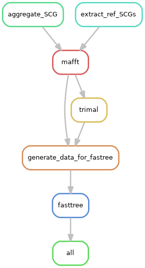

# STRONG - Strain Resolution ON Graphs

## Overview

STRONG resolves strains on assembly graphs by resolving variants on core COGs using co-occurrence across multiple samples.

## Prerequisites

The following pieces of software should be installed on your machine before attempting to install STRONG
    - conda (miniconda)
    - cmake, zlib, GNU readline, G++
    
For a standard Ubuntu 16.04 distribution. The above packages would be installed as:

```
    sudo apt-get update
    sudo apt-get -y install libbz2-dev libreadline-dev cmake g++ zlib1g zlib1g-dev
```

Python is also need for the conda install we recommend Python 3.7.
To install miniconda follow the instructions (here)[https://docs.conda.io/en/latest/miniconda.html]:

## Installation

STRONG can be installed anywhere but for the below we assume it will be placed in a location
SPATH that you set as an environment variable:
 that you 
may have to create in your home dir:
```
export SPATH=/mypath/to/repos
cd $SPATH
```

We begin by cloning STRONG recursively:

```
git clone --recurse-submodules https://github.com/chrisquince/STRONG.git
```

STRONG contains [DESMAN](https://github.com/chrisquince/DESMAN) and [BayesPaths](https://github.com/chrisquince/BayesPaths) as submodules.

If you need to update in future:

```
cd STRONG
git submodule foreach git pull origin master
```

We recommend that you first compile the SPAdes and COG tools executables outside of conda:

```
cd ./STRONG/SPAdes/assembler

./spades_compile.sh

./build_cog_tools.sh 

```

The full list of requirements is listed in the file conda_env.yaml we recommend mamba for install. This can be 
itself installed through conda by:
```
conda install -c conda-forge mamba
```

Then we use mamba to resolve the STRONG environment from within the STRONG home directory:

```
cd $SPATH/STRONG

mamba env create -f conda_env.yaml
```

This should take 5 - 10 minutes with mamba.


Once the STRONG environment has been installed activate it with the following command :

```
conda activate STRONG
```


It is also necessary to install the BayesPaths executable with the STRONG conda:

```
cd BayesPaths
python ./setup.py install
```

BayesPaths use precompiled executables in the runfg_source directory. These are only compatible 
with Linux x86-64 and on other platforms they will require compilation from source see
the [BayesPaths repo](https://github.com/chrisquince/BayesPaths]) for details. 


We will also need a version of the COG database installed. We make this available for download 
and it can be placed anywhere. Here we point the DB_PATH variable to its location which should 
be chosen appropriately:

```
export DB_PATH=/path/to_my/database
cd $DB_PATH
wget https://strongtest.s3.climb.ac.uk/rpsblast_cog_db.tar.gz
tar -xvzf rpsblast_cog_db.tar.gz
```

Unfortunately there is a bug in the conda CONCOCT package caused by updates to Pandas
this needs to be fixed before running the pipeline:

```
CPATH=`which concoct_refine`
sed -i 's/values/to_numpy/g' $CPATH
sed -i 's/as_matrix/to_numpy/g' $CPATH
sed -i 's/int(NK), args.seed, args.threads)/ int(NK), args.seed, args.threads, 500)/g' $CPATH
```

## Native installation (Not supported yet)

STRONG has a lot of required software, this is an attempt to demonstrate how to install all of them to avoid the 
conda recipe above. 


## Quick start

First we will download a fairly simple synthetic test data set from known microbial strains into another directory 
/mypath/torunthings/STRONG_Runs that we will use for STRONG output:

```
export SRPATH=/mypath/torunthings/STRONG_Runs
mkdir $SRPATH
cd  $SRPATH
wget https://strongtest.s3.climb.ac.uk/Test.tar.gz
tar -xvzf Test.tar.gz
```

We are now ready to run STRONG from within the COG_pipe directory. The config.yaml file will 
need to edited first though. The following edits are necessary:

1. The data directory needs to point at the samples to be assembled in this case edit:

```
data: /mypath/torunthings/STRONG_Runs/Test
```

2. The cog_database field to:
```
cog_database: /path/to_my/database/rpsblast_cog_db/Cog
```

3. The evaluation genomes field which contains the known genomes to validate to 
```
genomes: /mypath/torunthings/STRONG_Runs/Test/Eval
```
For real data this step would be deactivated by setting 'execution: 0'

All these paths need to be absolute see below for more details on the config file.

Then run the following command:

```
cd $SPATH/STRONG/COG_pipe
python3 ./start.py --config config.yaml $SRPATH/TestResults --threads 8 --dryrun --verbose
```

This will run the pipeline in 'dryrun' mode which will list commands to be run without actually 
executing. This can only get as far as a checkpoint where an assertion error will be generated. Do 
not worry about this. If it looks similar to:
```
Step #3 - Strain Decomposition
...

AssertionError in line 176 of /home/ubuntu/repos/STRONG/COG_pipe/Common.snake.
  File "/home/ubuntu/repos/STRONG/COG_pipe/BayesAGraph.snake", line 7, in <module>
  File "/home/ubuntu/repos/STRONG/COG_pipe/Common.snake", line 176, in read_selected_bins
Traceback (most recent call last):
  File "./start.py", line 105, in <module>
    call_snake(["--snakefile", "BayesAGraph.snake"])
  File "./start.py", line 80, in call_snake
    subprocess.check_call(base_params + extra_params, stdout=sys.stdout, stderr=sys.stderr)
  File "/home/ubuntu/miniconda3/envs/STRONG/lib/python3.7/subprocess.py", line 363, in check_call
    raise CalledProcessError(retcode, cmd)
subprocess.CalledProcessError: Command '['snakemake', '--directory', '/home/ubuntu/STRONG_Runs/TestResults', '--cores', '8', '--config', 'LOCAL_DIR=/home/ubuntu/repos/STRONG/COG_pipe', '--latency-wait', '120', '-k', '-p', '-r', '--verbose', '--dryrun', '--snakefile', 'BayesAGraph.snake']' returned non-zero exit status 1.
```

Then it is fine to run the actual pipeline as follows:
```
python3 ./start.py --config config.yaml $SRPATH/TestResults --threads 8 --verbose
```
The number of threads is optional and should be set as appropriate to your system.


## Config file

```
# ------ Samples ------
samples: '*' # specify a list samples to use or '*' to use all samples

# ------ Resources ------
threads : 8 # single task nb threads

# ------ Assembly parameters ------ 
data: /mnt/gpfs/Hackathon/Test  # path to data folder

# ----- Annotation database -----
cog_database: /home/sebr/seb/Database/rpsblast_cog_db/Cog # COG database

# ----- SPAdes tools dependency -----
soft: /home/sergei/cog_tools

# ----- Binning parameters ------
concoct_contig_size: 1000
read_length: 150
assembly: 
    assembler: spades
    k: [77]
    mem: 2000
    threads: 24
    dir: /home/sergei/cog_tools/spades/bin

# ----- BayesPaths parameters ------
bayespaths:
    nb_strains: 16

# ----- DESMAN parameters ------
desman:
    execution: 1
    nb_haplotypes: 10
    nb_repeat: 5
    min_cov: 1

# -----  MAGAnalysis ------
maganalysis: 
    execution: 0

# -----  Evaluation ------
evaluation:
    execution: 1
    genomes: "/mnt/gpfs/Hackathon/Test/Eval" # path to refferences genomes 
```

## Pipeline
# Assembly and binning 

# BayesAGraohsSVA

# Desman 
to be uploaded
# MAGanalysis

# Evaluation
