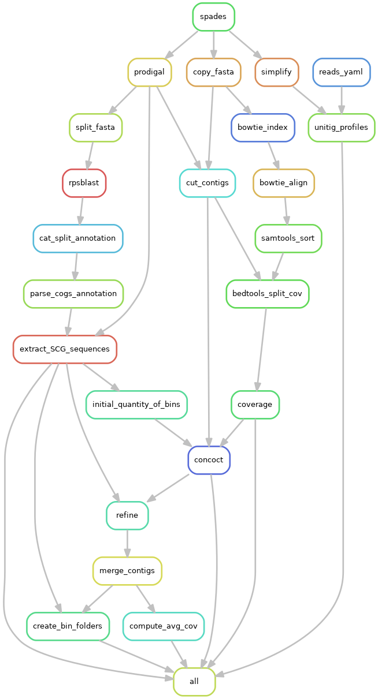

# STRONG - Strain Resolution ON Graphs

## Overview

STRONG resolves strain on assembly graphs by resolving variants on core COGs using co-occurrence across multiple samples.

## Prerequisites

The following pieces of software should be installed on your machine before attempting to install STRONG
    - Conda
    - cMake

## Installation

Requires recursive cloning:

```
git clone --recurse-submodules https://github.com/chrisquince/STRONG.git
```

To update

```
cd STRONG/COG_pipe
git submodule foreach git pull origin master
```

The full list of requirement is listed in the file conda_env.yaml and can be installed through conda with the following command :

```
conda env create -f conda_env.yaml
```

Once the STRONG environment has been installed activate it with the following command :

```
conda activate STRONG
```

Next compile SPAdes by running the following commands :

```
cd ../SPAdes/assembler
./spades_compile.sh
```

## Quick start

Run from within the COG_pipe directory. Using the following command:

```
python3 ./start.py --config config.yaml output_dir --threads 32
```

Optionally pass snakemake parameters with the -s option e.g. '-s --dryrun'

## Config file

```
# ------ Samples ------
samples: '*' # specify a list samples to use or '*' to use all samples

# ------ Resources ------
threads : 8 # single task nb threads

# ------ Assembly parameters ------ 
data: /mnt/gpfs/Hackathon/Test  # path to data folder

# ----- Annotation database -----
cog_database: /home/sebr/seb/Database/rpsblast_cog_db/Cog # COG database

# ----- SPAdes tools dependency -----
soft: /home/sergei/cog_tools

# ----- Binning parameters ------
concoct_contig_size: 1000
read_length: 150
assembly: 
    assembler: spades
    k: [77]
    mem: 2000
    threads: 24
    dir: /home/sergei/cog_tools/spades/bin

# ----- BayesPaths parameters ------
bayespaths:
    nb_strains: 16

# ----- DESMAN parameters ------
desman:
    execution: 1
    nb_haplotypes: 10
    nb_repeat: 5
    min_cov: 1

# -----  MAGAnalysis ------
maganalysis: 
    execution: 0

# -----  Evaluation ------
evaluation:
    execution: 1
    genomes: "/mnt/gpfs/Hackathon/Test/Eval" # path to refferences genomes 
```

## Pipeline
# Assembly and binning 

# BayesAGraohsSVA

# Desman 
to be uploaded
# MAGanalysis

# Evaluation
